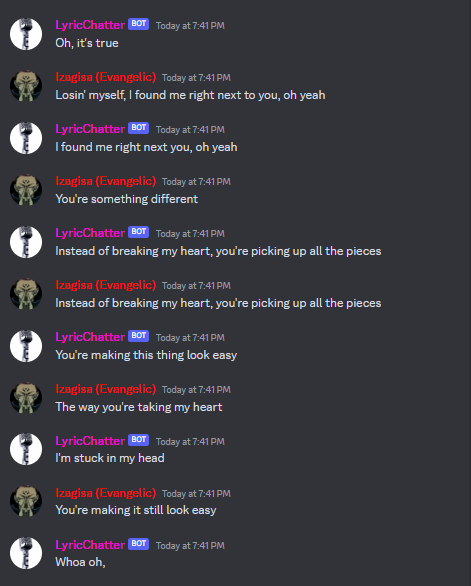

# Python meme Magician 🧙‍♂️
Welcome to LyricChatter Discord bot! A simple and a silly script I made where you can sing with a bot, or by the bot itself :P. Check thumbnail


## 🌈 What's Inside?
- **LyricChatter.py:** This is where the fun things begin! This script serve as the bot's script, so it can sing a lyrics with you, or by itself! 

## 🚀 How to Use?
**Before using this, make sure you have your bot and token prepared**

1. **LyricChatter.py**: Invoke the `LyricChatter.py` first.
2. **Command**: To run it, simply run `>sing [ARTIST:str] [MUSIC_NAME:str] [DELAY:int] [SING_TOGETHER: 1 | 0]`
For instance, let's say you want to sing `Marshmello - Ritual` with the bot, where each lyric delay are 50, you can run:
`>sing Marshmello ritual 50`
Or, you want the bot sing by itself, simply run:
`>sing Marshmello ritual 50 0`
3. **Continuing the Lyrics**: Actually, you don't to be specific with the lyric. If the lyric is "I'm withou' you", you can say "Im without you", and it is still acceptable.
4. **Stopping the Lyrics**: Just run, `>stop`.. Simple :D!

## 📜 Instructions:
1. **Clone the repository:**
```bash
git clone https://github.com/DaemonPooling/Discord-lyric-chatter-bot.git
```

2. **Navigate to the Project Folder:**
```bash
cd Discord-lyric-chatter-bot
```

3. **Install Dependencies:**
```bash
pip install -r requirements.txt
```

4. **Configure the environment variables (.env): (I assume you know how to do this)**
```
BOT_TOKEN='PUT_YOUR_BOT_TOKEN_HERE'
```

5. **Locate through source directory:**
```bash
cd source
```

6. **Run LyricChatter.py:**
```bash
python source/fetcher.py
```

## Incoming updates:
- [] Score rating, a way of rating how well you write your lyrics.
- [] VC support, this will be either happened or not happened. But I will surely do it, if this is getting a good likes
